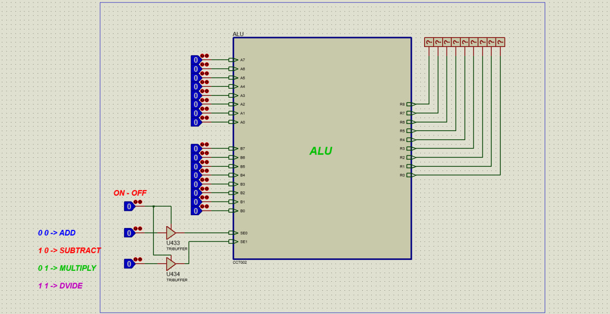

# 8-bit ALU (Arithmetic and Logic Unit)

This repository contains the design and implementation of an 8-bit ALU (Arithmetic and Logic Unit) using **Proteus** for a Computer Architecture course project. The ALU performs basic arithmetic operations such as **addition, subtraction, multiplication, and division**.

## Table of Contents
- [Project Overview](#project-overview)
- [Features](#features)
- [Technologies Used](#technologies-used)
- [How It Works](#how-it-works)
- [Usage](#usage)
- [Conclusion](#conclusion)

## Project Overview
This ALU project demonstrates a basic implementation of an 8-bit ALU, capable of performing four fundamental arithmetic operations. The project was built and simulated using **Proteus**, allowing visualization of the data flow and operations.

The ALU takes two 8-bit input values and a **2-bit control signal** to determine which arithmetic operation should be performed.

## Features
- **8-bit arithmetic operations:**
  - **Addition** (A + B) – Control: `00`
  - **Subtraction** (A - B) – Control: `10`
  - **Multiplication** (A * B) – Control: `01`
  - **Division** (A / B) – Control: `11`
- Modular design, allowing for easy expansion.

## Technologies Used
- **Proteus**: Used for digital circuit simulation.
- **Logic Gates & Multiplexers**: To implement arithmetic logic.

## How It Works
- **Inputs**: 
  - Two **8-bit** data inputs (`A`, `B`).
  - A **2-bit control signal** to select the operation:
    | Control Signal | Operation |
    |--------------|------------|
    | 00 | Addition (A + B) |
    | 01 | Multiplication (A * B) |
    | 10 | Subtraction (A - B) |
    | 11 | Division (A / B) |

- **Operation Execution**:
  - A multiplexer selects the corresponding arithmetic circuit based on the **2-bit control signal**.
  - The ALU processes the inputs and outputs the **8-bit result**.
  - The **result** is displayed using LEDs or a 7-segment display.

### 🧮 Project viewv 
 


## Usage
1. Clone the repository:
   ```bash
   git clone https://github.com/USERNAME/8-bit-ALU.git
